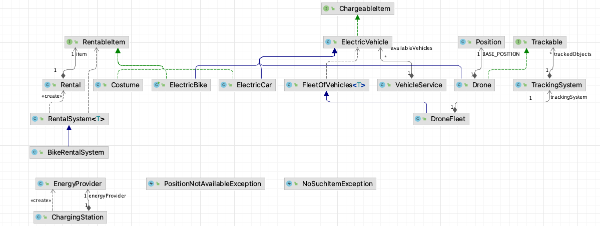

# POO to ASD : TD4

ENONCES : Ouvrir le pdf sur votre machine pour pouvoir copier/coller des éléments de l'énoncé.

Ici [TD4.pdf](TD4.pdf)

Les codes du précédent TD sont dans le répertoire associé.

